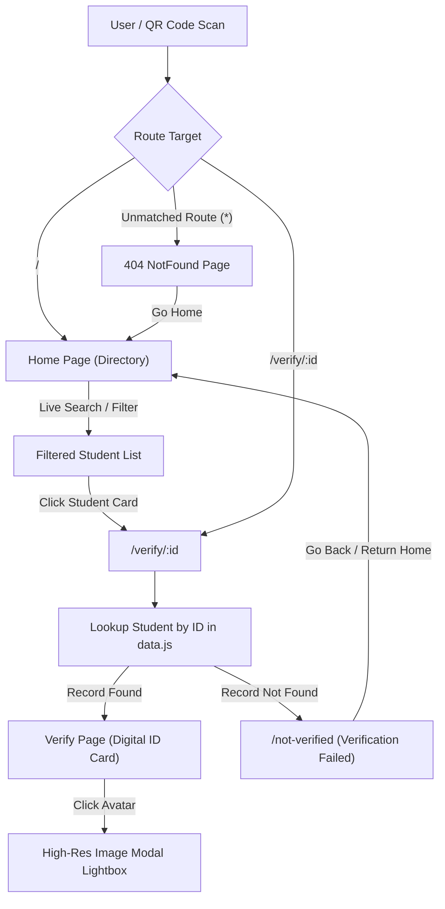

# 🪪 Digital ID Card Portal & Verification System

[](https://react.dev/)
[](https://vitejs.dev/)
[](https://tailwindcss.com/)
[](https://reactrouter.com/)
[](https://www.framer.com/motion/)
[](https://www.netlify.com/)

A modern, responsive, and secure **Digital Student ID Card Portal and Verification Web Application** built with **React 19**, **Vite 7**, and **Tailwind CSS v4**. 

Designed for academic institutions and college mini-projects, this application enables security personnel, exam invigilators, and faculty members to quickly authenticate student credentials via physical or digital QR code scanning or by searching through an interactive digital registry.

---

## 📌 Table of Contents

- [Overview](#-overview)
- [Key Features](#-key-features)
- [System Architecture & Routing Flow](#-system-architecture--routing-flow)
- [Project Structure](#-project-structure)
- [Data Model & Schema](#-data-model--schema)
- [Tech Stack](#-tech-stack)
- [Getting Started](#-getting-started)
  - [Prerequisites](#prerequisites)
  - [Installation](#installation)
  - [Development Server](#development-server)
  - [Production Build](#production-build)
- [QR Code Verification Workflow](#-qr-code-verification-workflow)
- [Deployment Configuration](#-deployment-configuration)
- [Future Enhancements](#-future-enhancements)
- [Author & Credits](#-author--credits)

---

## 🌟 Overview

Physical student ID cards are prone to damage, wear, loss, and forgery. The **Digital ID Card System** addresses this problem by serving as a single source of truth for identity validation:

1. **Instant Verification**: Scanning a student's card QR code opens their individual verification link (`/verify/:id`) directly on any smartphone or tablet.
2. **Cardholder Registry**: Administrators or campus staff can search and view all enrolled student ID cards from the central dashboard.
3. **High Security Trust Signal**: Visual feedback states confirm whether the cardholder's ID is active, authentic, or invalid.

---

## ✨ Key Features

- **🔍 Live Search & Filter Directory**: Filter students dynamically by name, registration ID (e.g. `CT001`), or role in real time.
- **📊 Metric Statistics Overview**: Glanceable counter cards tracking total registered IDs, active students, and overall verification compliance.
- **🪪 Rich Digital ID Card Layout**:
  - College/Institution branding watermark banner.
  - Formatted personal credentials: Full name, Role, ID number, Date of Birth, Gender (with gender icons), and Blood Group.
  - Click-to-contact links for Student Email (`mailto:`) and Phone Number (`tel:`).
  - Residential address formatting.
  - Issued timestamp and official verification date.
- **⚡ Dynamic Credential Lookup & Loading Screen**: Smooth loading spinner and credentials validation sequence built using **Framer Motion**.
- **🖼️ Profile Photo Lightbox Modal**: Clickable avatar permitting inspectors to expand profile imagery for closer inspection.
- **🚫 Comprehensive Error Fallbacks**:
  - **Not Verified Screen (`/not-verified`)**: Visual warning when an ID is unrecognized or missing, with quick navigation back.
  - **404 Not Found Screen (`/404`)**: Clean route handler for unknown URLs.
- **📱 Fully Responsive & Mobile-First**: Crafted with modern **Tailwind CSS v4** styling optimized for smartphones, tablets, and desktops.
- **🌐 Single-Page Application (SPA) Netlify Routing**: Pre-configured with `netlify.toml` rewrite rules to prevent 404 errors during direct QR code URL navigation.

---

## 🔄 System Architecture & Routing Flow



---

## 📁 Project Structure

```text
vite-project/
├── public/
│   └── vite.svg                  # Favicon / public assets
├── src/
│   ├── assets/
│   │   └── react.svg             # React branding asset
│   ├── Pages/
│   │   ├── Home.jsx              # Main directory portal with search & stats
│   │   ├── NotFound.jsx          # Custom 404 Not Found fallback page
│   │   ├── NotVerified.jsx       # Verification failure error screen
│   │   └── Verify.jsx            # Dynamic ID card view with modal lightbox
│   ├── App.css                   # Global component styles
│   ├── App.jsx                   # React Router routing configuration
│   ├── data.js                   # Mock database containing student records
│   ├── index.css                 # Tailwind CSS v4 imports
│   └── main.jsx                  # React 19 application entry point
├── .gitignore                    # Git ignored files (node_modules, dist, etc.)
├── eslint.config.js              # ESLint 9 configuration rules
├── index.html                    # HTML template entry point
├── netlify.toml                  # Netlify SPA redirect rules (/* -> /index.html)
├── package.json                  # Project dependencies & scripts
├── README.md                     # Comprehensive project documentation
└── vite.config.js                # Vite 7 build configuration with Tailwind v4
```

---

## 📋 Data Model & Schema

Student records are maintained in `src/data.js`. Each student record conforms to the following schema:

```javascript
{
  id: "CT001",                                      // Unique Student ID Identifier
  name: "SATHISH KUMAR P",                          // Student Full Name
  Role: "Student",                                  // Designation / Academic Role
  dob: "12/09/2006",                                // Date of Birth (DD/MM/YYYY)
  companyName: "College Digital ID",               // Institution / Department
  Address: "3/348 karipatti, Salem 636021",         // Residential Address
  Mail_Id: "Sathish19@gmail.com",                   // Email Address
  Blood_group: "N/A",                              // Blood Group (e.g., A -ve, O+ ve)
  Phone_number: "+91 9922125621",                  // Contact Phone Number
  gender: "male",                                   // Gender ("male" | "female")
  profileImage: "https://example.com/avatar.jpg",   // Photo URL or empty string
  Verification_Date: "01/09/2025"                  // Identity Verification Timestamp
}
```

> **Note**: If `profileImage` is an empty string, the application automatically displays an avatar badge styled with the student's first initial.

---

## 🛠️ Tech Stack

| Category | Technology | Description |
| :--- | :--- | :--- |
| **Framework** | [React 19](https://react.dev/) | Component-based UI library |
| **Tooling & Bundler** | [Vite 7](https://vitejs.dev/) | Next-generation frontend tooling with lightning-fast HMR |
| **Styling** | [Tailwind CSS v4](https://tailwindcss.com/) | Modern utility-first CSS framework with `@tailwindcss/vite` |
| **Routing** | [React Router DOM v7](https://reactrouter.com/) | Declarative client-side routing |
| **Motion & Animation** | [Framer Motion 12](https://www.framer.com/motion/) | Production-ready motion and transition library for React |
| **Code Quality** | [ESLint 9](https://eslint.org/) | Automated code linting and standard compliance |
| **Hosting & Redirects** | [Netlify](https://www.netlify.com/) | Pre-configured SPA rewrite rules via `netlify.toml` |

---

## 🚀 Getting Started

Follow these steps to run the project locally on your machine.

### Prerequisites

Ensure you have the following installed:
- [Node.js](https://nodejs.org/) (version **18.x** or higher recommended)
- [npm](https://www.npmjs.com/) (bundled with Node.js) or `yarn` / `pnpm`

### Installation

1. **Clone the repository**:
   ```bash
   git clone https://github.com/IT-HARISH-R/Digital-Id-card.git
   cd Digital-Id-card/vite-project
   ```

2. **Install dependencies**:
   ```bash
   npm install
   ```

### Development Server

Start the Vite development server with Hot Module Replacement (HMR):

```bash
npm run dev
```

Open your browser and navigate to:
```text
http://localhost:5173
```

### Production Build

To compile and optimize the application for production deployment:

```bash
npm run build
```

The compiled output will be generated inside the `dist/` directory.

To preview the production build locally:

```bash
npm run preview
```

---

## 📲 QR Code Verification Workflow

This project is tailored for integration with physical ID badges or digital wallet cards featuring QR codes:

1. **Generate QR Code**:
   Each student ID is encoded into a target URL formatted as:
   ```text
   https://<your-domain>.netlify.app/verify/<student_id>
   ```
   *Example*: `https://<your-domain>.netlify.app/verify/CT001`

2. **Scan the Card**:
   Any camera app or QR scanner reads the code and opens the verification link directly in the browser.

3. **Instant Validation**:
   The verification view checks the database:
   - ✅ **Valid ID**: Displays the full official credentials card with the green "Identity validated successfully" banner.
   - ❌ **Invalid / Tampered ID**: Redirects to the `/not-verified` error screen with diagnostic guidance.

---

## 🌐 Deployment Configuration

### Netlify Deployment

The project includes a `netlify.toml` configuration file in the project root:

```toml
[[redirects]]
  from = "/*"
  to = "/index.html"
  status = 200
```

This prevents `404 Not Found` errors when users navigate directly to deep routes (such as `/verify/CT001` or `/not-verified`) by rewriting all incoming requests to `index.html`.

**Build Settings**:
- **Build Command**: `npm run build`
- **Publish Directory**: `dist`
- **Node Version**: `>= 18.0.0`

---

## 🔮 Future Enhancements

- [ ] **Dynamic Database Integration**: Connect with Supabase, Firebase, or MongoDB for live student administration.
- [ ] **In-App QR Generator**: Built-in modal to generate and download printable QR code tags directly from the student dashboard.
- [ ] **Admin Authentication**: Role-based access control (RBAC) to allow faculty to add, edit, or revoke student passes.
- [ ] **Offline PWA Support**: Service worker caching allowing offline verification in low-connectivity areas.
- [ ] **Export to PDF**: Generate high-resolution printable ID cards and admit cards.

---
